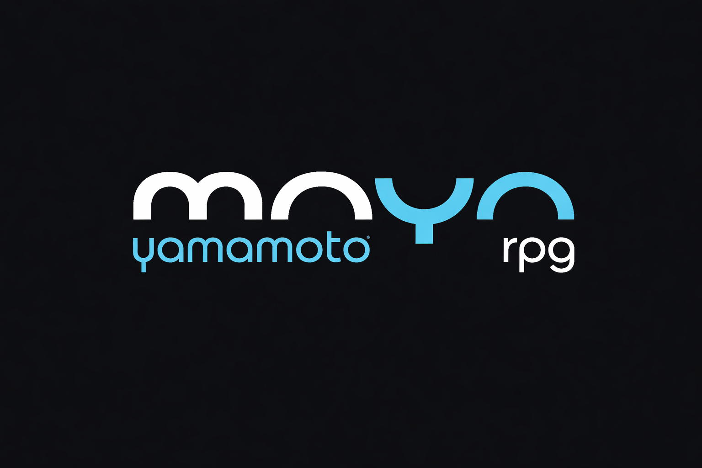

# FECAP - Fundação de Comércio Álvares Penteado

<p align="center">
<a href= "https://www.fecap.br/"></a>
</p>

# Maya RPG

## Maya Innovators

## Integrantes: <a href="https://www.linkedin.com/in/andreluisdesousa/">André Luis</a>, <a href="https://www.linkedin.com/in/enzo-minardi/">Enzo Minardi</a>, <a href="https://www.linkedin.com/in/joão-guilherme-gumiero-de-micheli/">Jõao Guilherme</a>, <a href="https://www.linkedin.com/in/samcoronel/">Samuel Cavalcanti</a>

## Professores Orientadores: <a href="https://www.linkedin.com/in/rodrigo-da-rosa-phd/">Rodrigo da Rosa</a>, <a href="https://www.linkedin.com/in/francisco-escobar/">Francisco Escobar</a>, <a href="https://www.linkedin.com/in/aimarlopes/">Aimar Lopes</a>, <a href="https://www.linkedin.com/in/victorbarq/">Jefferson de Oliveira</a>

## Descrição

<p align="center">
  
  <br>
  by <a href="https://mayayamamoto.com.br/">Maya yamoto</a> 
</p>


<br><br>
Este projeto consiste no desenvolvimento de um Aplicativo Mobile integrado a um Módulo Web com Backend e Banco de Dados para a Clínica Maya Yoshiko Yamamoto, com foco em Reeducação Postural Global (RPG). A solução permite que a profissional gerencie pacientes, prontuários e planos de exercícios, enquanto os pacientes acessam seus exercícios com vídeos ou imagens, realizam check-in de execução, registram nível de dor e acompanham sua evolução, centralizando informações e melhorando o acompanhamento clínico
<br><br>
<br><br>

## 🛠 Estrutura de pastas

-Raiz<br>
|<br>
|-->documentos<br>
  &emsp;|-->antigos<br>
  &emsp;|Documentação.docx<br>
|-->executáveis<br>
  &emsp;|-->windows<br>
  &emsp;|-->android<br>
  &emsp;|-->HTML<br>
|-->imagens<br>
|-->src<br>
  &emsp;|-->Backend<br>
  &emsp;|-->Frontend<br>
|readme.md<br>

A pasta raiz contem dois arquivos que devem ser alterados:

<b>README.MD</b>: Arquivo que serve como guia e explicação geral sobre seu projeto. O mesmo que você está lendo agora.

Há também 4 pastas que seguem da seguinte forma:

<b>documentos</b>: Toda a documentação estará nesta pasta.

<b>executáveis</b>: Binários e executáveis do projeto devem estar nesta pasta.

<b>imagens</b>: Imagens do sistema

<b>src</b>: Pasta que contém o código fonte.

## 🛠 Instalação

<b>Android:</b>

Faça o Download do JOGO.apk no seu celular.
Execute o APK e siga as instruções de seu telefone.

```sh
Coloque código do prompt de comnando se for necessário
```


## 💻 Configuração para Desenvolvimento

Descreva como instalar todas as dependências para desenvolvimento e como rodar um test-suite automatizado de algum tipo. Se necessário, faça isso para múltiplas plataformas.

Para abrir este projeto você necessita das seguintes ferramentas:

-<a href="https://godotengine.org/download">GODOT</a>

```sh
make install
npm test
Coloque código do prompt de comnando se for necessário
```

## 📋 Licença/License

## 🎓 Referências

Aqui estão as referências usadas no projeto.

